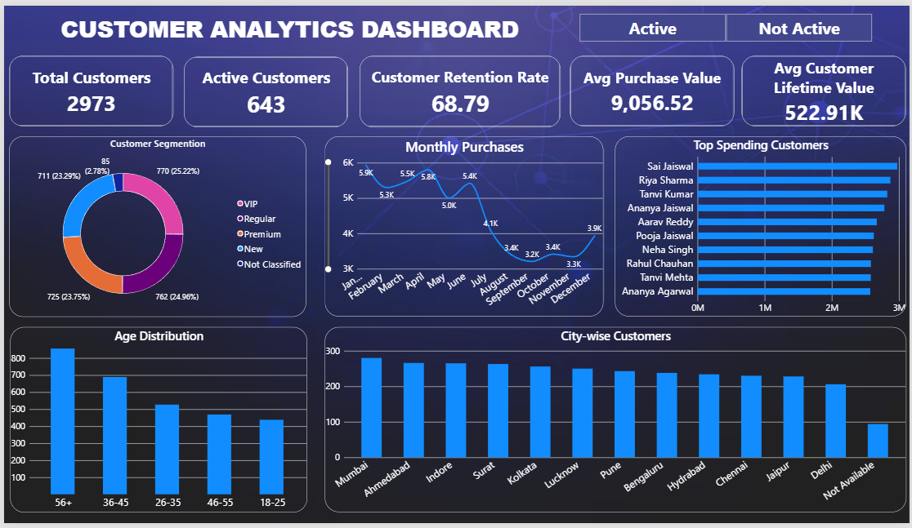

# instadot-internship-snehajaiswani-Day7
# Customer Analytics Dashboard

## Project Overview

This project focuses on analyzing customer data to understand customer behavior, purchasing patterns, retention performance, and customer value. The dataset was cleaned and transformed using Power Query, and an interactive dashboard was created in Power BI to provide meaningful business insights.

## Data Cleaning & Preprocessing

The original dataset contained multiple data quality issues. The following cleaning steps were performed:

* Removed duplicate customer records.
* Handled missing values in Customer ID, Age, City, Segment, and Retention Rate columns.
* Standardized city names by correcting spelling variations and removing extra spaces.
* Standardized customer segments and gender values to ensure consistency.
* Corrected invalid age values such as negative ages, zero values, and unrealistic ages above 100.
* Replaced missing values using appropriate methods to maintain data integrity.
* Created age groups for customer distribution analysis.

## KPIs Created

The dashboard includes the following key performance indicators:

* Total Customers
* Active Customers
* Customer Retention Rate
* Average Purchase Value
* Average Customer Lifetime Value (CLV)

## Visualizations Included

* Customer Segmentation Analysis
* Monthly Purchase Trends
* Top Spending Customers
* Age Distribution Analysis
* City-wise Customer Distribution

## Dashboard Features

* Interactive filtering using slicers.
* Dynamic KPI tracking.
* Customer behavior and purchasing trend analysis.
* Geographic customer distribution analysis.
* Identification of high-value customers.

## Tools Used

* Power BI
* Power Query
* DAX
* Microsoft Excel

## Dashboard Screenshot

## Business Objective

The objective of this dashboard is to help businesses understand customer engagement, identify valuable customer segments, monitor retention performance, and support data-driven decision making for customer growth and revenue optimization.
